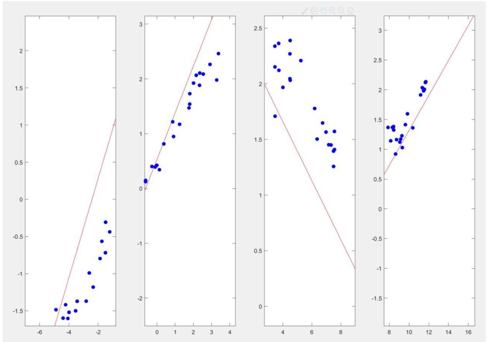

# Spline Linear Regression

This code provides a theoritical simple implementation of Spline Linear Regression from scratch.

The purpose of Spline learning is to fit linear models to each section of data. These sections have been chosen by diving the space to a specific number of equal sections.

Unfortunately this code **does not** use the Roughness Penalty Approach and as you see in the image below that is why it lacks roughness.

## Result
A visualization for the result has been demonstrated below.

